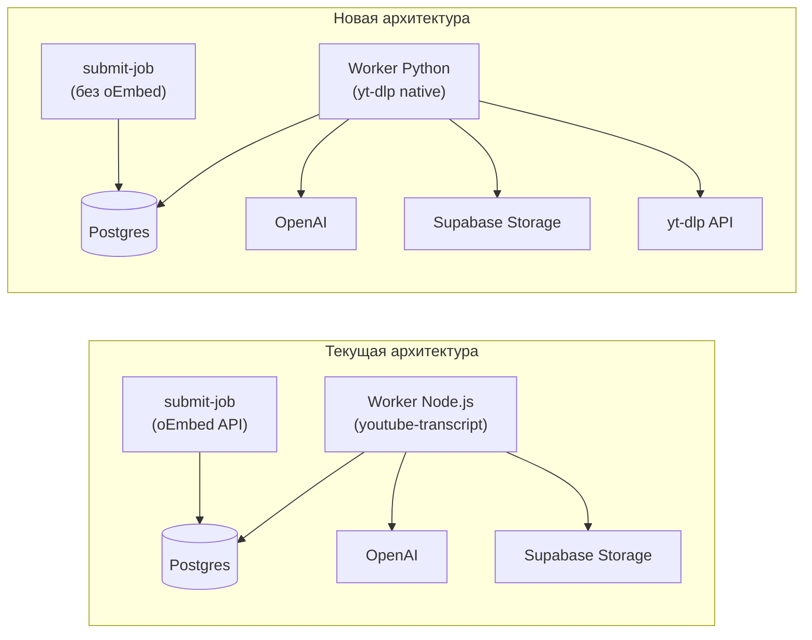
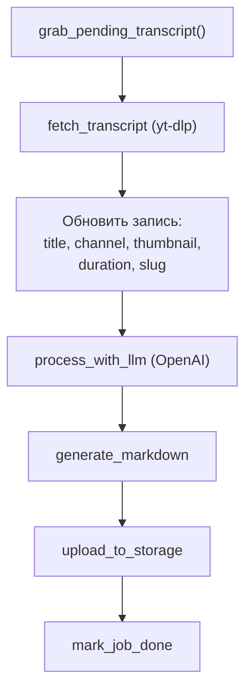

# Rewrite Worker in Python + yt-dlp

## Контекст

Текущая библиотека `youtube-transcript` (v1.2.1) ненадёжна: не находит субтитры у видео, где они есть. Решение -- заменить на [yt-dlp](https://github.com/yt-dlp/yt-dlp), самый надёжный инструмент для работы с YouTube (150k+ stars, активная разработка).

Поскольку yt-dlp -- Python-библиотека с мощным Python API, проще переписать весь worker на Python, чем вызывать CLI как subprocess из Node.js. Worker маленький (~300 строк TS), риск переписывания минимален.

## Что меняется



## 1. Python worker -- структура проекта

Заменяем содержимое `worker/` (удаляем TS-файлы, создаём Python-проект):

```
worker/
  pyproject.toml          # зависимости + scripts
  Dockerfile              # python:3.12-slim + deno
  src/
    __init__.py
    main.py               # polling loop, graceful shutdown (порт index.ts)
    config.py              # env vars (порт config.ts)
    db.py                  # supabase-py client, job CRUD (порт db.ts)
    models.py              # dataclasses (порт types.ts)
    pipeline/
      __init__.py
      fetch_transcript.py  # yt-dlp: метаданные + субтитры
      process_with_llm.py  # OpenAI GPT-4o-mini (тот же промпт)
      generate_markdown.py # YAML frontmatter + секции
      upload_to_storage.py # supabase storage upload
```

Зависимости (`pyproject.toml`):

- `yt-dlp` -- извлечение субтитров и метаданных
- `yt-dlp-ejs` -- JS-компоненты для YouTube
- `supabase` (supabase-py) -- БД и Storage
- `openai` -- LLM pipeline
- `python-dotenv` -- env-файлы

## 2. yt-dlp интеграция (fetch_transcript.py)

Ключевой модуль. Использует **Python API** yt-dlp (не CLI subprocess):

```python
import yt_dlp

ydl_opts = {
    'writesubtitles': True,
    'writeautomaticsub': True,
    'subtitleslangs': ['en'],
    'subtitlesformat': 'json3/vtt/srt/best',
    'skip_download': True,
    'quiet': True,
    'no_warnings': True,
    'outtmpl': '/tmp/yt-dlp/%(id)s',
}

with yt_dlp.YoutubeDL(ydl_opts) as ydl:
    info = ydl.extract_info(url)
```

**Что извлекаем из yt-dlp:**

- `info['title']` -- название видео
- `info['channel']` -- название канала
- `info['channel_id']` -- YouTube channel ID
- `info['duration']` -- длительность в секундах
- `info['thumbnail']` -- URL превью
- `info['description']` -- описание
- Файл субтитров `/tmp/yt-dlp/{id}.en.json3` -- сегменты с таймкодами

**Парсинг субтитров (json3 формат):**

```python
for event in data['events']:
    text = ''.join(seg.get('utf8', '') for seg in event.get('segs', []))
    segments.append(RawSegment(
        text=text.strip(),
        offset=event['tStartMs'] / 1000,
        duration=event.get('dDurationMs', 0) / 1000,
    ))
```

Это даёт те же `RawSegment(text, offset, duration)` что и текущий `youtube-transcript`, поэтому остальной пайплайн (LLM, markdown, upload) работает без изменений в логике.

## 3. Расширенный пайплайн worker-а

Worker теперь берёт на себя **всю** работу с YouTube (метаданные ранее делал oEmbed):



Новый шаг `enrich`:

- Worker обновляет запись в `transcripts`: title, thumbnail_url, slug, duration_seconds
- Worker вызывает `find_or_create_channel(channel_name, channel_id)` (перемещаем из submit-job)
- Worker обновляет `channel_id` в записи

## 4. Упрощение submit-job (web)

Файл: `web/features/create-transcript/api/submit-job.ts`

**Удаляем:**

- `fetchVideoMetadata()` (oEmbed вызов)
- `findOrCreateChannel()` (перемещаем в worker)
- `slugify()` (перемещаем в worker)

**Что остаётся:**

- Проверка авторизации
- Проверка дубликатов по `youtube_video_id`
- Insert минимальной записи:

```typescript
await supabase.from("transcripts").insert({
  youtube_video_id: videoId,
  title: videoId,        // placeholder, worker обновит
  slug: videoId,         // videoId как slug, worker обновит
  status: "pending",
  language: "en",
  user_id: user.id,
});
```

Валидация URL (что видео существует) перемещается в worker -- если yt-dlp не может извлечь данные, job переходит в `failed` с понятным сообщением.

## 5. Docker

**Новый Dockerfile** (заменяет `deploy/docker/worker.Dockerfile`):

```dockerfile
FROM python:3.12-slim

# deno -- JS runtime для yt-dlp-ejs (рекомендуемый yt-dlp)
RUN apt-get update \
    && apt-get install -y --no-install-recommends curl unzip \
    && curl -fsSL https://deno.land/install.sh | DENO_INSTALL=/usr/local sh \
    && apt-get purge -y curl unzip && rm -rf /var/lib/apt/lists/*

WORKDIR /app
COPY worker/pyproject.toml .
RUN pip install --no-cache-dir .

COPY worker/src ./src
CMD ["python", "-m", "src.main"]
```

**docker-compose.prod.yml**: обновить секцию `worker` -- убрать зависимость от node, обновить build context.

## 6. Портирование модулей (1-к-1)

- `config.ts` -> `config.py` -- только синтаксис
- `db.ts` -> `db.py` -- `supabase-py` вместо `@supabase/supabase-js`
- `types.ts` -> `models.py` -- `dataclass` вместо `interface`
- `index.ts` -> `main.py` -- `asyncio` или синхронный polling
- `fetch-transcript.ts` -> `fetch_transcript.py` -- **полная замена**: yt-dlp вместо youtube-transcript
- `process-with-llm.ts` -> `process_with_llm.py` -- тот же промпт, `openai` Python SDK
- `generate-markdown.ts` -> `generate_markdown.py` -- только синтаксис
- `upload-to-storage.ts` -> `upload_to_storage.py` -- `supabase-py` storage API

## 7. Dashboard UX

При удалении oEmbed из submit-job, title станет placeholder (`videoId`) до обработки worker-ом. Нужно обновить `web/widgets/dashboard/`: показывать "Processing..." или videoId пока title не обновился (worker обновляет title за 10-30 секунд после подхвата задачи).

## 8. Удаление старого кода

- Все `worker/src/*.ts` файлы
- `worker/package.json`, `worker/package-lock.json`, `worker/tsconfig.json`
- Зависимость `youtube-transcript` уходит полностью

## Риски и митигация

- **yt-dlp тоже может сломаться при обновлении YouTube** -- но у yt-dlp 1500+ контрибьюторов и релизы каждые 1-3 дня, фиксы приходят быстро. Фиксировать версию в `pyproject.toml`, обновлять осознанно.
- **deno в Docker увеличивает образ** -- ~40MB, приемлемо для worker-а.
- **supabase-py API отличается от JS** -- различия минимальны, API похож.

## Задачи

1. [ ] Создать Python-проект: `pyproject.toml` с зависимостями (yt-dlp, supabase, openai, python-dotenv, yt-dlp-ejs), структуру `src/`
2. [ ] Реализовать `fetch_transcript.py`: yt-dlp Python API для извлечения метаданных (title, channel, duration, thumbnail) + субтитров (json3 парсинг в RawSegment[])
3. [ ] Портировать pipeline модули на Python: `process_with_llm.py` (OpenAI), `generate_markdown.py`, `upload_to_storage.py`
4. [ ] Портировать инфраструктурные модули: `config.py`, `db.py` (supabase-py), `models.py` (dataclasses), `main.py` (polling loop + graceful shutdown)
5. [ ] Добавить шаг 'enrich' в pipeline: обновление записи transcripts (title, slug, thumbnail, duration) и `find_or_create_channel` из метаданных yt-dlp
6. [ ] Упростить `submit-job.ts`: убрать oEmbed, убрать `findOrCreateChannel`, вставлять минимальную запись (videoId, userId, status=pending)
7. [ ] Обновить Dockerfile (`python:3.12-slim` + deno) и `docker-compose.prod.yml`
8. [ ] Обновить dashboard: показывать videoId/placeholder пока worker не обновил title
9. [ ] Удалить старый TS-код worker, `package.json`, `tsconfig.json`, зависимость `youtube-transcript`
10. [ ] Обновить `tasks/plan.md`: отметить замену youtube-transcript на yt-dlp и переход worker на Python
