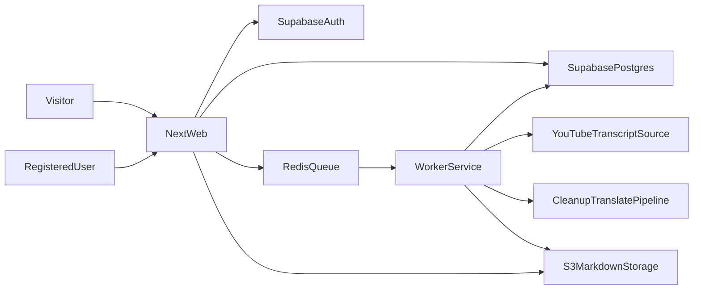

# План: Next.js стек и фазовые релизы

## Контекст и цель
Опираемся на требования из [`c:\Projects\youtube-to-text\agent.md`](c:\Projects\youtube-to-text\agent.md): SEO-first, чтение без авторизации, создание транскриптов только для зарегистрированных пользователей, хранение текстов в Markdown на S3, длительные задачи вынести в отдельный worker, запускать маленькими версиями.

## Технический стек (базовый)
- **Frontend/Web:** `Next.js` (App Router) + `React 19` + `TypeScript` + `Tailwind CSS`.
- **Auth/DB:** `Supabase` (Postgres + Auth).
- **Файлы транскриптов:** Supabase Storage (публичный бакет), в БД хранить только URL и метаданные. Путь: `transcripts/{shard}/{videoId}/{lang}.md`.
- **Долгие задачи:** отдельный `worker`-сервис (Node.js) + Postgres-as-queue (`FOR UPDATE SKIP LOCKED`), чтобы не упираться в таймауты веб-слоя.
- **AI/LLM шаги:** cleanup/структурирование/перевод через отдельные воркеры с ретраями и идемпотентностью.
- **Deploy:** self-host на VDS (Docker Compose: `next-app`, `worker`, `redis`, reverse proxy `Caddy/Nginx`).
- **Мониторинг:** Sentry + базовые метрики очереди/ошибок.

## Архитектура потока данных

## Фазовый roadmap релизов (малые версии)
- **v0.1 — SEO-ядро и чтение контента**
  - Публичные страницы: главная, страница транскрипта, страница канала.
  - SSG/ISR, sitemap, robots, canonical, базовая schema.org.
  - Рендер Markdown из S3 по URL из БД.
- **v0.2 — Авторизация и создание задач**
  - Регистрация/логин через Supabase Auth.
  - Форма добавления YouTube URL (только для авторизованных).
  - Создание записи задачи со статусами (`pending/queued/processing/done/failed`).
- **v0.3 — Worker и пайплайн обработки**
  - Отдельный worker с очередью и ретраями.
  - Шаги: transcript fetch -> cleanup -> sections+headings -> EN output -> сохранение `.md` в S3.
  - Сохранение timestamp-секций для jump-to-video.
- **v0.4 — Мультиязычность и UX качества**
  - Переводы в выбранные языки как отдельные job-ветки.
  - Страницы версий перевода, контроль ошибок и повторный запуск задачи.
- **v0.5 — Токены без реальной оплаты**
  - Внутренний token ledger (дебет/кредит за обработку).
  - Ограничение создания задач по балансу.
- **v0.6 — Реальные платежи**
  - Stripe/LemonSqueezy интеграция, webhook, пополнение токенов.
- **v0.7 — Семантический поиск (beta)**
  - Индексация транскриптов в векторное хранилище.
  - Поиск по смыслу с фильтрами (канал/теги).

## Тестирование и качество по фазам
- Unit: нормализация транскрипта, сегментация, token billing.
- Integration: `API -> queue -> worker -> S3 -> DB status`.
- E2E: создание задачи пользователем, ожидание статуса, просмотр результата.
- Наблюдаемость: алерты на рост `failed` задач и длительность обработки.

## Риски и решения
- **Таймауты обработки:** увести тяжелые операции в worker + очередь.
- **Стоимость хранения:** хранить контент в S3, в DB только metadata + URL.
- **SEO регресс:** контентные страницы держать SSG/ISR, минимум client-only блоков.
- **Стабильность пайплайна:** идемпотентные job-и и повторяемые шаги с retry/backoff.

## Прогресс

### Готово: Bootstrap (pre-v0.1)
- Next.js 16 + React 19 + Tailwind 4 — `web/` (App Router, FSD structure).
- Docker-конфиги для prod: `deploy/docker-compose.prod.yml` (Caddy, web, worker, redis).
- CI/CD: `.github/workflows/deploy.yml`.
- Дизайн-система: `design-system/youtube-to-text/MASTER.md`.

### Готово: Supabase local (2026-03-02)
- `supabase init` → `supabase/config.toml` (Postgres 17, Auth, Studio, Storage).
- `supabase start` — локальный Supabase в Docker (Studio на `:54323`, API на `:54321`, DB на `:54322`).
- Первая миграция `supabase/migrations/20260302155135_initial_schema.sql`:
  - `channels` (youtube_id, title, slug, thumbnail_url).
  - `transcripts` (youtube_video_id, title, slug, status, markdown_url, language, duration_seconds).
  - RLS: публичное чтение, индексы по slug/channel_id/status, триггер `updated_at`.
- Миграция `supabase/migrations/20260302192852_add_tags.sql`:
  - `tags` (name, slug) — теги каналов.
  - `channel_tags` (channel_id, tag_id) — many-to-many связь.
  - RLS: публичное чтение.
- Supabase-клиенты в `web/libs/supabase/`:
  - `server.ts` — Server Components (cookie-based, `@supabase/ssr`).
  - `client.ts` — Client Components (`createBrowserClient`).
  - `admin.ts` — service role (обход RLS, для worker).
  - `static.ts` — клиент без cookies для build-time (generateStaticParams, sitemap).
- `web/middleware.ts` — обновление сессии (deprecated в Next.js 16, заменить на `proxy` в v0.2).
- `.env` — локальные ключи (не в git).
- Подключение проверено: Server Component → `select` из `channels` → OK.

### Готово: v0.1 — SEO-ядро и чтение контента (2026-03-02)
- Дизайн-система реализована в CSS: Brutalism + Old Newspaper (Tailwind v4 `@theme`).
  - Шрифты: UnifrakturMaguntia (masthead), Cormorant Garamond (headlines), Libre Baskerville (body), Special Elite (meta).
  - Цвета: `#0a0a0a` (ink), `#f5f0e8` (paper), `#ffffff` (surface).
  - Paper noise texture overlay, horizontal rules (double/thin/thick/dashed), dropcap, halftone.
  - Markdown prose styling (`.prose-newspaper`).
- Layout: газетный masthead (VOL / EST / FREE), dateline, header + footer.
- Публичные страницы:
  - `/` — Latest Transcripts + Browse by Channel (ISR 1h).
  - `/transcripts/[slug]` — рендер Markdown из S3 + schema.org Article (ISR 24h).
  - `/channels/[slug]` — список транскриптов канала + schema.org CollectionPage (ISR 1h).
- SEO: `sitemap.ts` (динамическая), `robots.ts`, canonical URL, `generateMetadata`, JSON-LD.
- SSG: `generateStaticParams` для transcript и channel slug-ов.
- Data layer: `lib/data/transcripts.ts`, `lib/data/channels.ts`, `lib/markdown.ts`.
- Supabase: `static.ts` — клиент без cookies для build-time (generateStaticParams, sitemap).
- Types: `lib/types.ts` (Channel, Transcript, TranscriptWithChannel, ChannelWithTranscripts).
- Components: Header, Footer, TranscriptCard, HorizontalRule, MarkdownContent.
- `next.config.ts`: remotePatterns для YouTube-тамбнейлов.

### Готово: v0.2 — Авторизация и создание задач (2026-03-05)
- Auth: Google OAuth only через Supabase Auth (`[auth.external.google]` в `config.toml`).
- Миграция `supabase/migrations/20260305120000_add_profiles_and_user_id.sql`:
  - `profiles` (id → auth.users, display_name, avatar_url, preferred_languages).
  - Trigger `on_auth_user_created` → auto-create profile из Google metadata.
  - `transcripts.user_id` (nullable FK → auth.users).
  - RLS: профиль read/update только свой; insert транскриптов только auth.
- Новые FSD-слайсы в `web/`:
  - `entities/profile/` — тип Profile + API `getCurrentProfile`.
  - `features/auth/` — SignInButton, SignOutButton, UserMenu (Google OAuth flow).
  - `features/create-transcript/` — форма (YouTube URL + мультиселект языков, EN всегда включён).
  - `widgets/dashboard/` — DashboardJobList + StatusBadge (pending/queued/processing/done/failed).
  - `widgets/auth-cta/` — CTA-блок «Transcribe Your Own Videos» на страницах транскриптов.
  - `shared/ui/` — Header (с auth state), HeaderAuth, Footer (вынесены в layout).
- Новые маршруты:
  - `/login` — страница входа с кнопкой «Sign in with Google».
  - `/auth/callback` — OAuth callback handler (code → session → redirect to /dashboard).
  - `/dashboard` — защищённая страница: форма + список задач карточками.
- `middleware.ts` — защита `/dashboard` (redirect → `/login`), redirect auth-пользователей с `/login` → `/dashboard`.
- `app/layout.tsx` — Header и Footer вынесены из страниц в корневой layout.
- `app/transcripts/[slug]/page.tsx` — добавлен AuthCTA для неавторизованных пользователей.
- Google OAuth ключи хранятся в `.env` корня проекта (не в git).

### В работе: v0.3 — Worker и пайплайн обработки (2026-03-05)
- Решения: Postgres-as-queue (без Redis), OpenAI GPT-4o-mini, Supabase Storage.
- Миграция `supabase/migrations/20260305180000_worker_fields.sql`:
  - `retry_count`, `error_message`, `started_at` в `transcripts`.
  - `channel_id` стал nullable (баг-фикс v0.2).
  - RPC: `grab_pending_transcript`, `increment_retry_and_fail`, `recover_stale_jobs`.
- Server Action `web/features/create-transcript/api/submit-job.ts`:
  - YouTube oEmbed для метаданных, find/create channel, insert transcript (status=pending).
  - Форма обновлена: Server Action вместо прямого client-side insert.
- Worker сервис `worker/`:
  - Polling loop с graceful shutdown (SIGINT/SIGTERM).
  - Pipeline: fetch-transcript → process-with-llm → generate-markdown → upload-to-storage.
  - Конфиг: SUPABASE_URL, SUPABASE_SERVICE_ROLE_KEY, OPENAI_API_KEY.
- Docker: убран Redis, worker использует Postgres-as-queue.
  - `deploy/docker-compose.prod.yml`: удалён redis сервис, обновлён worker.
  - `deploy/docker/worker.Dockerfile`: обновлён для `worker/` директории.

### Следующие шаги
- Фаза **v0.4**: мультиязычность — переводы в выбранные языки как отдельные job-ветки.

### Бэклог: Observability (после v0.3)
1. **Sentry для worker** — подключить `@sentry/node` в `worker/src/index.ts`. Инфраструктура готова (`SENTRY_DSN_WORKER` уже передаётся в docker-compose), осталось инициализировать SDK и обернуть pipeline в error capture. Даст push/email-уведомления о любых ошибках worker-а.
2. **Healthcheck heartbeat** — worker периодически пингует внешний сервис (Healthchecks.io, бесплатный план). Если пинг пропал — алерт. Ловит и краши, и зависания (когда процесс жив, но не работает).

### Бэклог: Worker pipeline (после v0.3)
1. **Замена библиотеки получения субтитров** — текущая `youtube-transcript` (v1.2.1) ненадёжна: не находит субтитры у видео, где они есть. Исследовать и выбрать более надёжную альтернативу (например, `youtubei.js`, прямой парсинг YouTube innertube API, или серверный yt-dlp).
