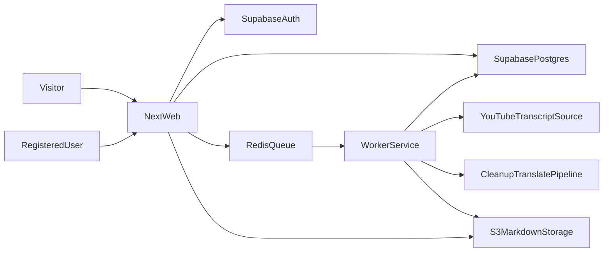

# План: Next.js стек и фазовые релизы

## Контекст и цель
Опираемся на требования из [`c:\Projects\youtube-to-text\agent.md`](c:\Projects\youtube-to-text\agent.md): SEO-first, чтение без авторизации, создание транскриптов только для зарегистрированных пользователей, хранение текстов в Markdown на S3, длительные задачи вынести в отдельный worker, запускать маленькими версиями.

## Технический стек (базовый)
- **Frontend/Web:** `Next.js` (App Router) + `React 19` + `TypeScript` + `Tailwind CSS`.
- **Auth/DB:** `Supabase` (Postgres + Auth).
- **Файлы транскриптов:** S3-совместимое хранилище (AWS S3/Cloudflare R2), в БД хранить только URL и метаданные.
- **Долгие задачи:** отдельный `worker`-сервис (Node.js) + очередь (`Redis + BullMQ`), чтобы не упираться в таймауты веб-слоя.
- **AI/LLM шаги:** cleanup/структурирование/перевод через отдельные воркеры с ретраями и идемпотентностью.
- **Deploy:** self-host на VDS (Docker Compose: `next-app`, `worker`, `redis`, reverse proxy `Caddy/Nginx`).
- **Мониторинг:** Sentry + базовые метрики очереди/ошибок.

## Архитектура потока данных

## Фазовый roadmap релизов (малые версии)
- **v0.1 — SEO-ядро и чтение контента**
  - Публичные страницы: главная, страница транскрипта, страница канала.
  - SSG/ISR, sitemap, robots, canonical, базовая schema.org.
  - Рендер Markdown из S3 по URL из БД.
- **v0.2 — Авторизация и создание задач**
  - Регистрация/логин через Supabase Auth.
  - Форма добавления YouTube URL (только для авторизованных).
  - Создание записи задачи со статусами (`queued/processing/done/failed`).
- **v0.3 — Worker и пайплайн обработки**
  - Отдельный worker с очередью и ретраями.
  - Шаги: transcript fetch -> cleanup -> sections+headings -> EN output -> сохранение `.md` в S3.
  - Сохранение timestamp-секций для jump-to-video.
- **v0.4 — Мультиязычность и UX качества**
  - Переводы в выбранные языки как отдельные job-ветки.
  - Страницы версий перевода, контроль ошибок и повторный запуск задачи.
- **v0.5 — Токены без реальной оплаты**
  - Внутренний token ledger (дебет/кредит за обработку).
  - Ограничение создания задач по балансу.
- **v0.6 — Реальные платежи**
  - Stripe/LemonSqueezy интеграция, webhook, пополнение токенов.
- **v0.7 — Семантический поиск (beta)**
  - Индексация транскриптов в векторное хранилище.
  - Поиск по смыслу с фильтрами (канал/теги).

## Тестирование и качество по фазам
- Unit: нормализация транскрипта, сегментация, token billing.
- Integration: `API -> queue -> worker -> S3 -> DB status`.
- E2E: создание задачи пользователем, ожидание статуса, просмотр результата.
- Наблюдаемость: алерты на рост `failed` задач и длительность обработки.

## Риски и решения
- **Таймауты обработки:** увести тяжелые операции в worker + очередь.
- **Стоимость хранения:** хранить контент в S3, в DB только metadata + URL.
- **SEO регресс:** контентные страницы держать SSG/ISR, минимум client-only блоков.
- **Стабильность пайплайна:** идемпотентные job-и и повторяемые шаги с retry/backoff.

## Прогресс

### Готово: Bootstrap (pre-v0.1)
- Next.js 16 + React 19 + Tailwind 4 — `src/` (App Router).
- Docker-конфиги для prod: `deploy/docker-compose.prod.yml` (Caddy, web, worker, redis).
- CI/CD: `.github/workflows/deploy.yml`.
- Дизайн-система: `design-system/youtube-to-text/MASTER.md`.

### Готово: Supabase local (2026-03-02)
- `supabase init` → `supabase/config.toml` (Postgres 17, Auth, Studio, Storage).
- `supabase start` — локальный Supabase в Docker (Studio на `:54323`, API на `:54321`, DB на `:54322`).
- Первая миграция `supabase/migrations/20260302155135_initial_schema.sql`:
  - `channels` (youtube_id, title, slug, thumbnail_url).
  - `transcripts` (youtube_video_id, title, slug, status, markdown_url, language, duration_seconds).
  - RLS: публичное чтение, индексы по slug/channel_id/status, триггер `updated_at`.
- Supabase-клиенты в `src/lib/supabase/`:
  - `server.ts` — Server Components (cookie-based, `@supabase/ssr`).
  - `client.ts` — Client Components (`createBrowserClient`).
  - `admin.ts` — service role (обход RLS, для worker).
- `src/middleware.ts` — обновление сессии (deprecated в Next.js 16, заменить на `proxy` в v0.2).
- `src/.env.local` — локальные ключи (не в git).
- Подключение проверено: Server Component → `select` из `channels` → OK.

### Готово: v0.1 — SEO-ядро и чтение контента (2026-03-02)
- Дизайн-система реализована в CSS: Brutalism + Old Newspaper (Tailwind v4 `@theme`).
  - Шрифты: UnifrakturMaguntia (masthead), Cormorant Garamond (headlines), Libre Baskerville (body), Special Elite (meta).
  - Цвета: `#0a0a0a` (ink), `#f5f0e8` (paper), `#ffffff` (surface).
  - Paper noise texture overlay, horizontal rules (double/thin/thick/dashed), dropcap, halftone.
  - Markdown prose styling (`.prose-newspaper`).
- Layout: газетный masthead (VOL / EST / FREE), dateline, header + footer.
- Публичные страницы:
  - `/` — Latest Transcripts + Browse by Channel (ISR 1h).
  - `/transcripts/[slug]` — рендер Markdown из S3 + schema.org Article (ISR 24h).
  - `/channels/[slug]` — список транскриптов канала + schema.org CollectionPage (ISR 1h).
- SEO: `sitemap.ts` (динамическая), `robots.ts`, canonical URL, `generateMetadata`, JSON-LD.
- SSG: `generateStaticParams` для transcript и channel slug-ов.
- Data layer: `lib/data/transcripts.ts`, `lib/data/channels.ts`, `lib/markdown.ts`.
- Supabase: `static.ts` — клиент без cookies для build-time (generateStaticParams, sitemap).
- Types: `lib/types.ts` (Channel, Transcript, TranscriptWithChannel, ChannelWithTranscripts).
- Components: Header, Footer, TranscriptCard, HorizontalRule, MarkdownContent.
- `next.config.ts`: remotePatterns для YouTube-тамбнейлов.

### Следующий шаг
- Фаза **v0.2**: авторизация (Supabase Auth), форма добавления YouTube URL, создание задач со статусами.
