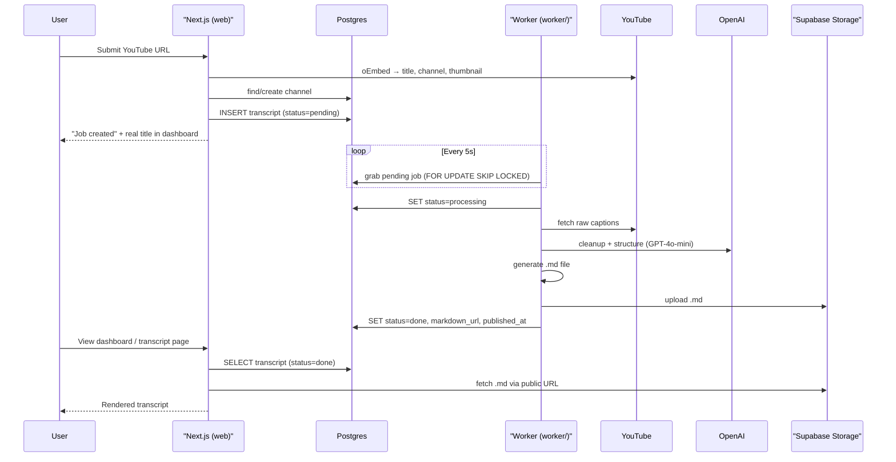

# v0.3 — Worker и пайплайн обработки

## Принятые решения

- **Очередь**: Postgres-as-queue (`FOR UPDATE SKIP LOCKED`), без Redis
- **Worker**: отдельный Node.js процесс в `worker/` (тот же репо)
- **LLM**: OpenAI (GPT-4o-mini для cleanup/structuring)
- **Хранилище**: Supabase Storage (публичный бакет `transcripts`)
- **Метаданные видео**: YouTube oEmbed API (без API-ключа)

## Задачи

- [ ] 1. Миграция БД: retry_count, error_message, started_at + channel_id nullable + RPC function для grab job
- [ ] 2. Web: Server Action для формы (oEmbed, find/create channel, insert transcript)
- [ ] 3. Worker: инициализация проекта (package.json, tsconfig, config, db client, polling loop)
- [ ] 4. Worker pipeline: fetch raw transcript (youtube-transcript)
- [ ] 5. Worker pipeline: OpenAI cleanup + structuring (GPT-4o-mini, structured output)
- [ ] 6. Worker pipeline: generate .md file по спеке transcript-format.md
- [ ] 7. Worker pipeline: upload to Supabase Storage + update DB
- [ ] 8. Docker: убрать Redis, обновить worker Dockerfile и docker-compose
- [ ] 9. Обновить plan.md и data-storage.md

## 1. Миграция БД

Файл: `supabase/migrations/YYYYMMDD_worker_fields.sql`

Добавить в таблицу `transcripts`:

- `retry_count integer not null default 0` — счётчик повторов
- `error_message text` — причина ошибки
- `started_at timestamptz` — начало обработки (для детекции зависших задач)

Сделать `channel_id` nullable (сейчас `NOT NULL`, но форма вставляет `null` — это баг v0.2):

```sql
ALTER TABLE public.transcripts ALTER COLUMN channel_id DROP NOT NULL;
```

Создать Postgres function для grab job (Supabase JS не поддерживает `FOR UPDATE SKIP LOCKED`):

```sql
UPDATE transcripts
SET status = 'processing', started_at = now()
WHERE id = (
  SELECT id FROM transcripts
  WHERE status = 'pending'
  ORDER BY created_at
  FOR UPDATE SKIP LOCKED
  LIMIT 1
)
RETURNING *;
```

## 2. Web: Server Action для формы

Сейчас форма (`web/features/create-transcript/ui/CreateTranscriptForm.tsx`) вставляет запись напрямую из клиента с placeholder-заголовком и `channel_id: null`. Нужно:

- Создать **Server Action** `submitTranscriptJob` в `web/features/create-transcript/api/submit-job.ts`:
  - Принимает `videoId` + `languages`
  - Валидирует авторизацию (`auth.getUser()`)
  - Вызывает YouTube oEmbed (`https://www.youtube.com/oembed?url=...&format=json`) — получает `title`, `author_name`, `thumbnail_url`
  - Находит или создаёт канал в `channels` по `author_name`
  - Генерирует slug из title (slugify)
  - Вставляет `transcripts` запись: реальный title, channel_id, status=`"pending"`, thumbnail_url
- Обновить форму — вызывать Server Action вместо прямого insert

Результат: пользователь сразу видит реальное название видео в dashboard.

## 3. Worker сервис

### Структура

```
worker/
  src/
    index.ts              — entry point: polling loop + graceful shutdown
    config.ts             — env vars (SUPABASE_URL, SERVICE_ROLE_KEY, OPENAI_API_KEY)
    db.ts                 — Supabase admin client + SQL-запросы (grab job, update status)
    pipeline/
      index.ts            — оркестратор: запускает шаги последовательно
      fetch-transcript.ts — получение raw captions с YouTube
      process-with-llm.ts — OpenAI: cleanup + структурирование в секции
      generate-markdown.ts— сборка .md файла (frontmatter + body) по спеке transcript-format.md
      upload-to-storage.ts— загрузка в Supabase Storage
    types.ts              — минимальные типы (TranscriptJob, PipelineResult)
  package.json            — deps: @supabase/supabase-js, openai, youtube-transcript
  tsconfig.json           — target: ES2022, module: NodeNext
  Dockerfile
```

### Polling loop (`index.ts`)

```typescript
while (!shuttingDown) {
  const job = await grabNextJob();   // SELECT ... WHERE status='pending' FOR UPDATE SKIP LOCKED LIMIT 1
  if (job) {
    await processJob(job);
  } else {
    await sleep(5_000);
  }
}
```

На старте: recovery зависших задач — `WHERE status='processing' AND started_at < now() - interval '15 min'` → сброс в `"pending"` (если retry_count < 3) или `"failed"`.

### Grab job (`db.ts`)

Через Supabase RPC (вызов Postgres function из миграции):

```typescript
const { data, error } = await supabase.rpc('grab_pending_transcript');
```

### Pipeline steps

**Step 1: fetch-transcript.ts**

- Библиотека `youtube-transcript` — получает массив `{ text, offset, duration }[]`
- Если captions не найдены → status=`"failed"`, error_message

**Step 2: process-with-llm.ts**

- Вход: raw segments с timestamps
- Один вызов OpenAI GPT-4o-mini с system prompt:
  - Очисти текст (грамматика, filler words)
  - Разбей на логические секции с заголовками
  - Для каждой секции укажи timestamp начала
  - Верни структурированный JSON: `{ sections: [{ title, timestamp, content }] }`
- Structured output (JSON mode) для надёжного парсинга

**Step 3: generate-markdown.ts**

- Вход: структурированные секции + метаданные из DB
- Выход: строка `.md` файла по спеке `docs/transcript-format.md`:
  - YAML frontmatter: video_id, title, channel, duration, language, sections
  - Body: `<!-- t:SECONDS -->` + `## Heading` + параграфы
- Duration = последний segment offset + duration (из raw transcript)

**Step 4: upload-to-storage.ts**

- Supabase Storage admin client: `storage.from('transcripts').upload(path, buffer)`
- Путь по конвенции `docs/data-storage.md`: `{shard}/{videoId}/en.md`
- shard = первые 2 символа videoId
- Получаем public URL через `storage.from('transcripts').getPublicUrl(path)`

**Финал: update DB**

- `status = 'done'`
- `markdown_url = publicUrl`
- `published_at = now()`
- `duration_seconds` = вычисленная длительность

При ошибке на любом шаге: `status = 'failed'`, `error_message`, `retry_count++`.

## 4. Supabase Storage — bucket

Worker создаёт бакет при первом запуске через admin client:

```typescript
await supabase.storage.createBucket('transcripts', { public: true });
```

## 5. Docker — убрать Redis

Обновить `deploy/docker-compose.prod.yml`:

- Удалить сервис `redis` и volume `redis_data`
- Worker: убрать `depends_on: redis` и `REDIS_URL`
- Worker: добавить `SUPABASE_URL`, `SUPABASE_SERVICE_ROLE_KEY`, `OPENAI_API_KEY`

Обновить `deploy/docker/worker.Dockerfile`:

- `COPY worker/` вместо `COPY src/`

## 6. Документация

- Обновить `tasks/plan.md`: секция "Готово: v0.3", убрать Redis из техстека
- Обновить `docs/data-storage.md`: описать Supabase Storage bucket, worker env vars

## Схема полного flow



## Что НЕ входит в v0.3

- Переводы на другие языки (v0.4)
- Выбор языков в форме пока не используется worker-ом (форма сохраняет, worker обрабатывает только EN)
- Token ledger (v0.5)
- Мониторинг Sentry (можно добавить, но не блокер)
