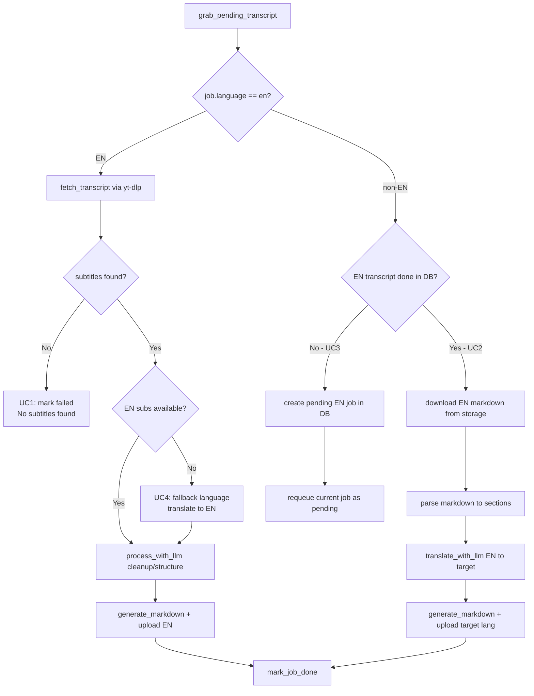

# v0.4 — Мультиязычный worker pipeline

## Контекст

Worker (v0.3) обрабатывает все задачи одинаково: fetch → LLM cleanup → markdown → upload. Поле `language` в job передаётся как `target_lang` в yt-dlp, но нет ветвления EN vs non-EN. Web-форма уже создаёт отдельную запись на каждый язык и всегда включает EN.

Use cases описаны в `worker/agent.md`.

## Архитектура нового pipeline



## Use cases

### UC1: Видео без субтитров

- Видео не имеет ни ручных, ни автоматических субтитров
- `fetch_transcript` бросает RuntimeError
- Worker ловит ошибку → `status=failed`, `error_message="No subtitles found"`
- Уже работает, нужен тест

### UC2: Non-EN job + EN transcript уже готов в БД

- Приходит job с `language != "en"` (например `"ru"`)
- В БД есть запись для того же `youtube_video_id` с `language="en"` и `status="done"`
- Worker скачивает EN markdown из storage
- Парсит markdown обратно в sections (`parse_markdown_to_sections`)
- Переводит sections через `translate_with_llm` (EN → target)
- Генерирует markdown для target language, загружает в storage
- `status=done`

### UC3: Non-EN job + EN transcript не существует

- Приходит job с `language != "en"` (например `"ru"`)
- В БД нет записи для того же `youtube_video_id` с `language="en"`
- Worker создаёт pending EN job в БД (если ещё нет)
- Текущий non-EN job возвращается в `status=pending`
- EN job обрабатывается первым (приоритизация в RPC)
- При следующем poll non-EN job попадёт в UC2

### UC4: EN job, но нет EN субтитров на YouTube

- Приходит job с `language="en"`
- yt-dlp не находит EN субтитров
- Fallback: берёт субтитры на любом доступном языке (например `"es"`)
- `source_language="es"`, pipeline переводит на EN
- Частично уже реализовано в `fetch_transcript` (fallback logic)
- Нужен тест для полного flow

---

## Задачи

- [ ] 1. Временно отключить OpenAI
- [ ] 2. Миграция: приоритизация EN в очереди
- [ ] 3. Новые функции в db.py
- [ ] 4. Модуль parse_markdown.py
- [ ] 5. Рефакторинг run.py (ветвление EN / non-EN)
- [ ] 6. Настройка pytest
- [ ] 7. Тесты на все use cases

---

## 1. Временно отключить OpenAI

Цель: не тратить лимиты OpenAI при каждом прогоне тестов и отладке.

### `worker/src/pipeline/process_with_llm.py`

Закомментировать вызов `client.chat.completions.create`. Вместо этого — простая группировка сегментов в секции:

```python
def process_with_llm(segments, source_language="en"):
    # --- OpenAI DISABLED for development ---
    # client = OpenAI(api_key=config.OPENAI_API_KEY)
    # response = client.chat.completions.create(...)
    # --- END DISABLED ---

    # Pass-through: group every 20 segments into a section
    CHUNK = 20
    sections = []
    for i in range(0, len(segments), CHUNK):
        chunk = segments[i:i + CHUNK]
        sections.append(ProcessedSection(
            title=chunk[0].text[:80],
            timestamp=int(chunk[0].offset),
            content=" ".join(s.text for s in chunk),
        ))
    return sections
```

### `worker/src/pipeline/translate_with_llm.py`

Закомментировать вызов `client.chat.completions.create`. Вместо этого — identity (вернуть как есть):

```python
def translate_sections(sections, source_language, target_language):
    # --- OpenAI DISABLED for development ---
    # client = OpenAI(api_key=config.OPENAI_API_KEY)
    # response = client.chat.completions.create(...)
    # --- END DISABLED ---

    # Pass-through: return sections unchanged
    return sections
```

### Файлы

- `worker/src/pipeline/process_with_llm.py`
- `worker/src/pipeline/translate_with_llm.py`

---

## 2. Миграция: приоритизация EN jobs в очереди

Для UC3 нужно, чтобы EN задачи обрабатывались раньше non-EN. Переопределить RPC `grab_pending_transcript`.

### Файл: `supabase/migrations/YYYYMMDD_prioritize_en_jobs.sql`

```sql
-- v0.4: prioritize EN jobs so non-EN translations can depend on them.
-- EN jobs are always processed before non-EN for the same created_at window.

CREATE OR REPLACE FUNCTION public.grab_pending_transcript()
RETURNS SETOF public.transcripts
LANGUAGE sql
VOLATILE
SECURITY DEFINER
AS $$
  UPDATE public.transcripts
  SET status     = 'processing',
      started_at = now()
  WHERE id = (
    SELECT id
    FROM public.transcripts
    WHERE status = 'pending'
    ORDER BY (CASE WHEN language = 'en' THEN 0 ELSE 1 END), created_at
    FOR UPDATE SKIP LOCKED
    LIMIT 1
  )
  RETURNING *;
$$;
```

---

## 3. Новые функции в db.py

### `find_done_transcript(video_id, language) -> dict | None`

Найти готовый транскрипт (status=done) для видео на указанном языке. Используется в UC2 для проверки наличия EN версии.

```python
def find_done_transcript(video_id: str, language: str) -> dict | None:
    sb = get_supabase()
    result = sb.table("transcripts") \
        .select("id, markdown_url, duration_seconds") \
        .eq("youtube_video_id", video_id) \
        .eq("language", language) \
        .eq("status", "done") \
        .limit(1) \
        .execute()
    if result.data and len(result.data) > 0:
        return result.data[0]
    return None
```

### `create_pending_job(video_id, language, user_id) -> None`

Создать pending задачу (для EN зависимости в UC3). Пропустить если запись уже есть.

```python
def create_pending_job(video_id: str, language: str, user_id: str | None) -> None:
    sb = get_supabase()
    try:
        sb.table("transcripts").insert({
            "youtube_video_id": video_id,
            "language": language,
            "title": video_id,
            "slug": f"{video_id}-{language}" if language != "en" else video_id,
            "status": "pending",
            "user_id": user_id,
        }).execute()
    except Exception as e:
        if "duplicate" in str(e).lower() or "unique" in str(e).lower():
            logger.info("job already exists for %s/%s, skipping", video_id, language)
        else:
            raise
```

### `requeue_job(job_id) -> None`

Вернуть задачу в status=pending (для UC3 — non-EN job ждёт пока EN будет готов).

```python
def requeue_job(job_id: str) -> None:
    sb = get_supabase()
    sb.table("transcripts").update({
        "status": "pending",
        "started_at": None,
    }).eq("id", job_id).execute()
```

### `download_markdown_from_storage(markdown_url) -> str`

Скачать содержимое markdown файла из Supabase Storage по public URL. Используется в UC2.

```python
def download_markdown_from_storage(markdown_url: str) -> str:
    import urllib.request
    with urllib.request.urlopen(markdown_url) as resp:
        return resp.read().decode("utf-8")
```

### Файл

- `worker/src/db.py`

---

## 4. Модуль parse_markdown.py

Парсит markdown (формат из `generate_markdown`) обратно в `list[ProcessedSection]`. Нужен для UC2: скачали EN markdown → распарсили → перевели.

### Формат входного markdown

```
---
video_id: "abc123"
title: "Video Title"
...
---

<!-- t:0 -->
## Section Heading

Section content text...

<!-- t:120 -->
## Another Heading

More content...
```

### Функция

```python
def parse_markdown_to_sections(markdown: str) -> list[ProcessedSection]:
    # 1. Skip YAML frontmatter (between --- and ---)
    # 2. Split by <!-- t:SECONDS --> markers
    # 3. Extract ## Heading and content from each block
    # 4. Return list of ProcessedSection(title, timestamp, content)
```

### Файл

- `worker/src/pipeline/parse_markdown.py`

---

## 5. Рефакторинг run.py (ветвление EN / non-EN)

Разделить `run_pipeline` на два пути в зависимости от `job.language`.

### Новая структура

```python
def run_pipeline(job: TranscriptJob) -> PipelineResult:
    if job.language == "en":
        return _run_en_pipeline(job)
    else:
        return _run_translation_pipeline(job)
```

### `_run_en_pipeline(job)` — обработка EN задач

Текущая логика (UC1 + UC4):

1. `fetch_transcript(video_id, target_lang="en")` — yt-dlp с fallback
2. `find_or_create_channel` + `enrich_transcript` — метаданные
3. `process_with_llm(segments)` — cleanup/structure
4. Если source != en: `translate_sections` (fallback → en, UC4)
5. `generate_markdown` + `upload_to_storage`
6. Return `PipelineResult`

### `_run_translation_pipeline(job)` — обработка non-EN задач

Новая логика (UC2 + UC3):

1. `find_done_transcript(video_id, "en")`
2. **Если EN найден (UC2):**
   - `download_markdown_from_storage(en_transcript.markdown_url)`
   - `parse_markdown_to_sections(md_content)`
   - `translate_sections(sections, "en", job.language)`
   - `generate_markdown(...)` + `upload_to_storage(...)`
   - Обогатить job метаданными из EN записи (enrich_transcript)
   - Return `PipelineResult`
3. **Если EN не найден (UC3):**
   - `create_pending_job(video_id, "en", job.user_id)`
   - `requeue_job(job.id)`
   - Raise специальное исключение `DependencyPending` (не считается ошибкой)

### Обработка DependencyPending в main.py

```python
try:
    result = run_pipeline(job)
    mark_job_done(job.id, result.markdown_url, result.duration_seconds)
except DependencyPending:
    logger.info("job %s waiting for EN dependency", job.id)
    # job уже requeued внутри pipeline, ничего не делаем
except Exception as e:
    mark_job_failed(job.id, str(e))
```

### Файлы

- `worker/src/pipeline/run.py` — основные изменения
- `worker/src/main.py` — обработка DependencyPending
- `worker/src/models.py` — добавить `DependencyPending` exception

---

## 6. Настройка pytest

### `worker/pyproject.toml`

Добавить dev-зависимости:

```toml
[project.optional-dependencies]
dev = [
    "pytest",
    "pytest-mock",
]
```

### Структура тестов

```
worker/
  tests/
    __init__.py
    conftest.py
    test_uc1_no_subs.py
    test_uc2_translate_from_en.py
    test_uc3_create_en_dependency.py
    test_uc4_no_en_subs.py
    test_parse_markdown.py
```

### `conftest.py` — общие фикстуры

- `make_job(**overrides)` — фабрика `TranscriptJob` с дефолтами
- `mock_segments` — список `RawSegment` для тестов
- `mock_metadata` — `VideoMetadata` для тестов
- `sample_markdown` — готовый markdown для теста парсинга

---

## 7. Тесты на use cases

### `test_uc1_no_subs.py` — UC1: нет субтитров

- Mock `fetch_transcript` → бросает `RuntimeError("No subtitles available for video ...")`
- Вызвать `run_pipeline(job)` → ожидать `RuntimeError`
- Проверить что `mark_job_failed` вызван с правильным сообщением

### `test_uc2_translate_from_en.py` — UC2: non-EN + EN готов

- `job.language = "ru"`
- Mock `find_done_transcript("video123", "en")` → возвращает `{markdown_url: "...", duration_seconds: 300}`
- Mock `download_markdown_from_storage` → возвращает sample EN markdown
- Проверить что `parse_markdown_to_sections` вызван
- Проверить что `translate_sections` вызван с `("en", "ru")`
- Проверить что `upload_to_storage` вызван с language="ru"
- Проверить что `mark_job_done` вызван

### `test_uc3_create_en_dependency.py` — UC3: non-EN + EN нет

- `job.language = "ru"`
- Mock `find_done_transcript("video123", "en")` → возвращает `None`
- Вызвать `run_pipeline(job)` → ожидать `DependencyPending`
- Проверить что `create_pending_job("video123", "en", user_id)` вызван
- Проверить что `requeue_job(job.id)` вызван

### `test_uc4_no_en_subs.py` — UC4: EN job без EN субтитров

- `job.language = "en"`
- Mock `fetch_transcript` → возвращает `FetchResult(source_language="es", segments=[...], metadata=...)`
- Проверить что `translate_sections` вызван с `("es", "en")`
- Проверить что `upload_to_storage` вызван с language="en"
- Проверить что `mark_job_done` вызван

### `test_parse_markdown.py` — unit тесты parse_markdown

- Тест с корректным markdown → правильные sections
- Тест с пустым frontmatter → правильные sections
- Тест с одной секцией → один ProcessedSection
- Тест с пустой строкой → пустой список или ошибка

---

## Ключевые файлы для изменений

| Файл | Действие |
|---|---|
| `worker/src/pipeline/process_with_llm.py` | Закомментировать OpenAI |
| `worker/src/pipeline/translate_with_llm.py` | Закомментировать OpenAI |
| `supabase/migrations/YYYYMMDD_prioritize_en_jobs.sql` | Новый файл |
| `worker/src/db.py` | 4 новые функции |
| `worker/src/pipeline/parse_markdown.py` | Новый файл |
| `worker/src/pipeline/run.py` | Рефакторинг — ветвление EN/non-EN |
| `worker/src/main.py` | Обработка DependencyPending |
| `worker/src/models.py` | Добавить DependencyPending |
| `worker/pyproject.toml` | Добавить pytest |
| `worker/tests/` | Все тесты (6 файлов) |
